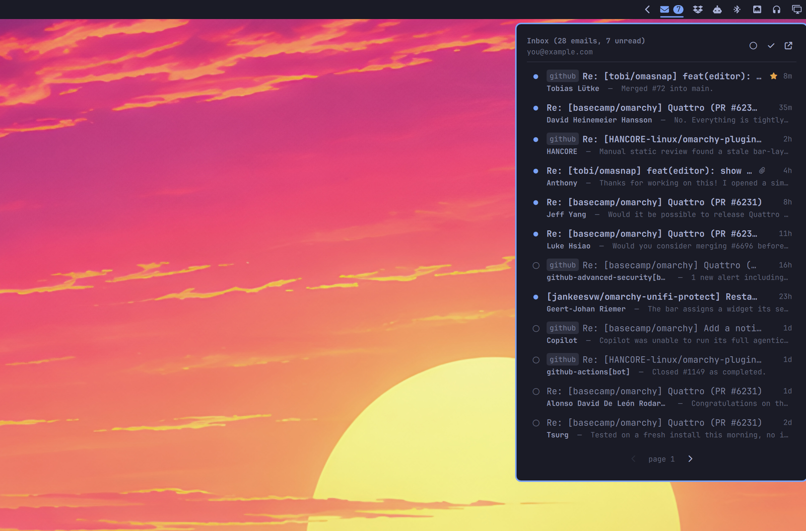

# Gmail Inbox

An Omarchy bar widget for your Gmail inbox: the unread count sits in the bar,
and the panel lists what is waiting - subject, sender, the first line of the
body, and how long it has been there.



- **Unread count in the bar.** The exact total for the whole label, not just
  what fits on a page.
- **A dot per message**, filled while unread and an outline once it has been
  read. Clicking it works both ways, so a mail can be put back to unread.
- **Stars**, shown where you set them and settable from the panel. The slot
  stays empty rather than absent, so the ages line up down one column.
- **A paperclip** on anything carrying an attachment.
- **Your own labels** as chips in front of the subject, resolved from label id
  to the name you gave it. Gmail's own bookkeeping - `INBOX`, the category
  tabs, `IMPORTANT` - is left out; it says nothing you did not know.
- **Paging** through everything the query matches, 25 at a time.
- **Unread only**, one button, for when the read ones are in the way.
- **Mark all as read**, covering every unread message in the label rather than
  only the page on screen.
- **Click a message** to open it in your browser, signed in to the right
  account. It is marked read at the same time.

## Requirements

This widget assumes you already have the [Google Workspace CLI][gws]
installed and authenticated - it owns the OAuth token, and no credential ever
passes through this plugin. `jq` is used for the JSON handling.

If you do not have it yet:

```bash
npm install -g @googleworkspace/cli
gws auth login -s gmail          # opens a browser; needs an interactive terminal
```

The login needs the `gmail.modify` scope, which is what `-s gmail` grants:
reading the inbox is not enough, marking a message as read is a write.

Check it with `gws auth status` - `"token_valid": true` means you are set.

[gws]: https://github.com/googleworkspace/google-workspace-cli

## Install

```bash
omarchy plugin add https://github.com/jankeesvw/omarchy-gmail-inbox
omarchy plugin enable jankeesvw.gmail-inbox
omarchy bar move jankeesvw.gmail-inbox --section right
```

Optionally bind the panel to a key, in `~/.config/omarchy/hypr/bindings.lua`:

```lua
o.bind("SUPER + M", "Gmail", "omarchy-shell shell toggle jankeesvw.gmail-inbox")
```

## Using it

| | |
|---|---|
| Click the bar icon | open the panel |
| Right-click the bar icon | open Gmail in the browser |
| Middle-click the bar icon | refresh now |
| Click a message | open it in the browser and mark it read |
| Click its dot | mark it read, or put it back to unread |
| Click its star | star or unstar it, panel stays open |
| `↑` `↓` or `j` `k` | move through the list |
| `Enter` or `o` | open the message under the cursor |
| `s` | star or unstar it |
| `Shift`+`I` | mark it read |
| `Shift`+`U` | mark it unread |
| `r` | toggle read either way |
| `a` | mark everything read |
| `f` | show only unread, or everything again |
| `n` / `p` | next page, previous page |
| `Esc` | close |

The keys Gmail has are the keys Gmail uses: `j`/`k` to move, `o` to open, `s`
to star, `Shift`+`I` and `Shift`+`U` for read and unread. Paging a list and
filtering to unread have no Gmail equivalent, so those took the plain letters.

The panel refreshes every minute, whether it is open or not, and again
whenever you open it or change something.

## Configuration

Settings live in `~/.config/omarchy-gmail-inbox/config`:

```ini
# Anything Gmail search understands.
query = in:inbox

# The label whose totals the bar counts. A user label needs its id, which
# `gws gmail users labels list` will tell you.
label = INBOX

# Messages per page, 1 to 50.
max = 25
```

Every key is optional; the defaults above are what you get without a file.
Changes are picked up on the next refresh, so within a minute.

`OMARCHY_GMAIL_QUERY`, `OMARCHY_GMAIL_LABEL` and `OMARCHY_GMAIL_MAX` do the
same job for a one-off run from a terminal, and take precedence over the file.

## How it works

`bin/gmail-inbox` is the whole backend; the QML only draws what it hands over.

A page costs four requests: the ids for the page, one search for which of them
are unread, one for which are starred, and one label read for the totals. The
two searches keep the dots honest without a request per message, so the cost
does not grow with the page size.

Everything that never changes about a message - subject, sender, snippet,
timestamp, thread, attachment, your labels - is cached per message id under
`$XDG_CACHE_HOME/omarchy-gmail-inbox` (mode 700, capped at 1000 entries).
Revisiting a page you have already seen therefore costs nothing extra.

Paging uses Gmail's `nextPageToken`, which only ever points forward, so going
back means remembering the tokens already used. Mark-all walks those pages
too: one request caps at 500 ids and hands back a token for the rest, and a
single call would silently stop there - on a label with 3383 unread it would
clear 500 and leave 2883 behind with nothing but the badge to hint at it.

Every `Text` in the QML is `Text.PlainText`, because subjects and snippets are
written by whoever sent the mail, and Qt's default would happily render an
`` in a subject as real rich text - an outbound request
from your shell process to a server the sender picked.

## Screenshots without your own mail in them

```bash
bin/gmail-inbox demo on
bin/gmail-inbox demo off
```

A fixed demo list with no network behind it, long enough to page through, and
every write turns into a no-op while it is on, so a screenshot session can
never touch a real mailbox.

## License

MIT
